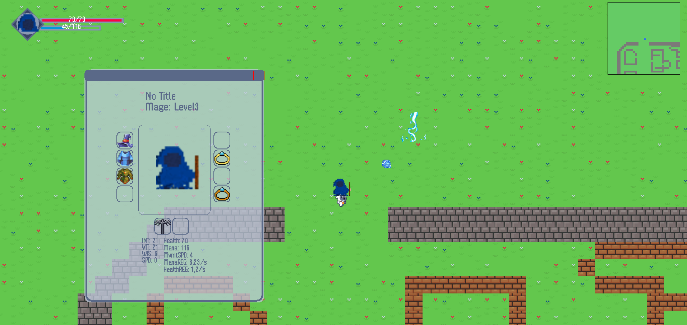

# Mage Quest FX

Welcome to Mage QuestFX my second Java game project!  
Now rewritten in Java FX!
Iam thinking about publishing it on steam for the fun of it so i stopped updating it here for the moment.

Thanks to www.youtube.com/@RyiSnow for making a great beginners tutorial which allowed me to start initially.  
I took some inspiration from his implementation but started to develop my own ideas early on.

## FEATURES:

### AI assisted programming

Starting with the release of Chat GPT from OpenAI, I began including AI in performance testing and optimizations,
generating comments, generating first drafts of new ideas etc.
As of late I also started to use AI generated images from the Dall E 2 model. It's great!

### Multiplayer (not updated since v2.+):

You can start the same programm twice on the same PC (localhost) or different PC's ( in the same network) and play
together!  
The host needs to press h + m (ingame) and the client needs to input the hosts local IP (eg. 192.168.x.xx) and the press
h + f.  
I used java sockets with a static port (60069).  
**I didn't yet update it to work correctly with the newest pathfinding updates.**

## Movement:

W - UP  
A - LEFT  
S - DOWN  
D - RIGHT

E - Talk to NPC's

## Combat:

Left Mouse Button - Primary Fire (1 Damage)  
Right Mouse Button - Secondary Fire (5 Damage)  
1 - Ability 1 (5 Damage)  
2 - Lightning (about 60 Damage)  
N - opens talent window (stub for now)

## Inventory

C - opens character panel  
B - opens bag panel  
N - talent panel  
You can drag and drop Items to different slots and swap them in place

## Graphics:

I made most of the background tiles myself, I did take inspiration from @RyiSnow's textures and games like
HeroSiege and other sources for some abilities etc. The pixel font called x12y16pxMaruMonica was made by hicc.
I started making the game in Swing but rewrote it to JavaFX which improved rendering time by about 15x.

## Roadmap:

Level system  
skills / skill pane
NPC's / bartering  

