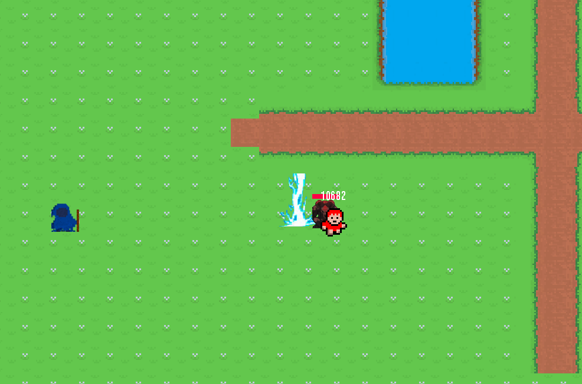

# Mage Quest_2D

Welcome to Mage Quest_2D my second Java game project!  
Now with playable .jar or .exe + JRE (if you don't want to install Java)!

Thanks to www.youtube.com/@RyiSnow for making a great beginners tutorial which allowed me to start initially.  
I took some inspiration from his implementation but started to develop my own ideas early on. That said for example the
pathfinding is more heavily copied and only a modified a bit.

## FEATURES:

### Multiplayer:

You can start the same programm twice on the same PC (localhost) or different PC's ( in the same network) and play
together!  
The host needs to press h + m (ingame) and the client needs to input the hosts local IP (eg. 192.168.x.xx) and the press
h + f.  
I used java sockets with a static port (60069).  
I didn't yet update it to work correctly with the newest pathfinding updates.

## Movement:

W - UP  
A - LEFT  
S - DOWN  
D - RIGHT

## Combat:

Left Mouse Button - Primary Fire (1 Damage)  
Right Mouse Button - Secondary Fire (5 Damage)  
1 - Ability 1 (5 Damage)
2 - Lightning (about 60 Damage)  
N - opens talent window (stub for now)

## Inventory

C - opens character panel  
B - opens bag panel  
You can drag and drop Items to different slots  
No slot restrictions yet, no bag window yet and no item and player stats yet

## Graphics:

I made most of the background tiles myself, I did take inspiration from @RyiSnow's textures and games like
HeroSiege and other sources for some abilities etc. The pixel font called x12y16pxMaruMonica was made by hicc.

## Roadmap:

Level system  
skills / skill pane  
dropped items  
inventory   
NPC's / bartering  

