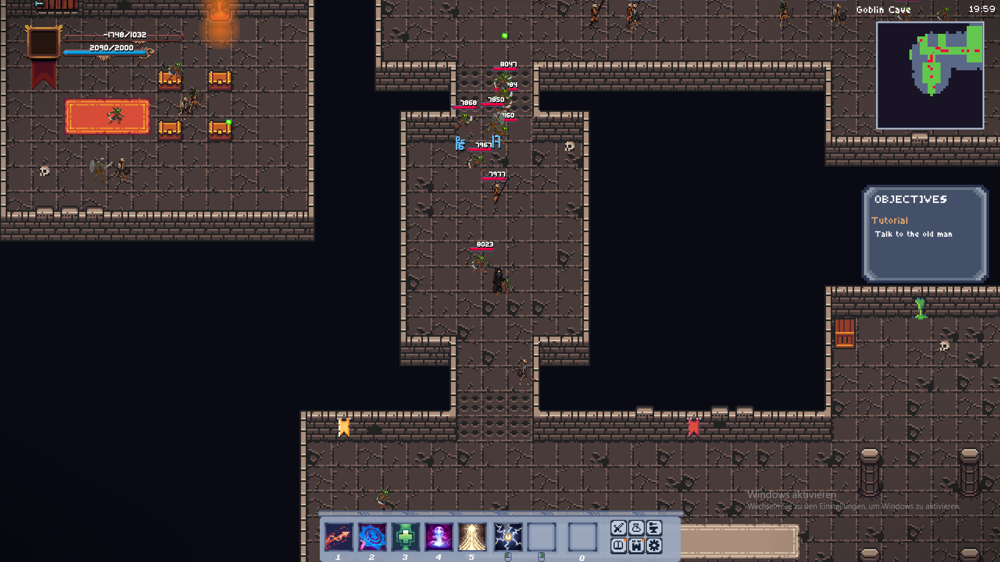

### To download the game head to [my itch.io page.](https://gk646.itch.io/mage-quest)
### For support, bug reports and talking head to [my discord server.](https://discord.gg/STCdEcBzUv)  

This is the source code of my game **Mage Quest**. This was my first real project and started only 1 1/2 months after I started learning Java so a lot
of the times it might not be very efficient. Effectively it took about 3 months in total and is about 21k lines.

Make sure to also look at the [credits](credits.txt), there's a ton of helpful resources out there.
- special thanks to [FastNoiseLite](https://github.com/Auburn/FastNoiseLite) for the Java noise class

## Graphics

The game was initially made using Java Swing but transitioned to JavaFX for a 15x decrease of render time. JavaFX is only used for handling sound and drawing pictures. For UI elements like windows and sliders, I made them completely natively to have 100% control over the style and feel. 
Most of the drawing is done through getting map data from maps, indexing into a list and drawing the respective picture. In total there are **5200 unique tile images** and about **1200 other game assets**. There's also a small lighting system that uses custom light textures which are drawn statically on top of fitting tiles.

- Major character textures from [craftpix.net](https://craftpix.net/freebies/)
- most tilesets and effect texture from [itch.io](https://itch.io/game-assets)

##  AI tools

ChatGPT 3.5 - 4 was used throughout the development for brainstorming, optimizing code and generating code. 
Dall E the image model was used to generate 95% of all 82 item icons.

## Database

With the introduction of items I created the first sqlite database. In the current version Iam using 2 sqlite files:

- first for all the user data, inventories, map cover progress and player stats. It will not have to be replaced ever, which allows for easy updates.
- second one for per update files like item database.

## Map Building

After inital manual attempts i quickly started using [Tiled.](https://www.mapeditor.org/) Tiled offers for different export formats. I used the .csv for reading map data and the json-like .tmj for reading spawn data. As I didn't want any major dependencies I am using regex to extract the rectangle information placed inside the map editor as spawn points. This also supports setting up area spawns, type and level.

## Packaging 

Iam using jlink to create a custom Java Runtime Environment that includes the necessary JavaFX modules. To then pack it into a .exe i used launch4J. It allows for nice customization and options no how to build the .exe.